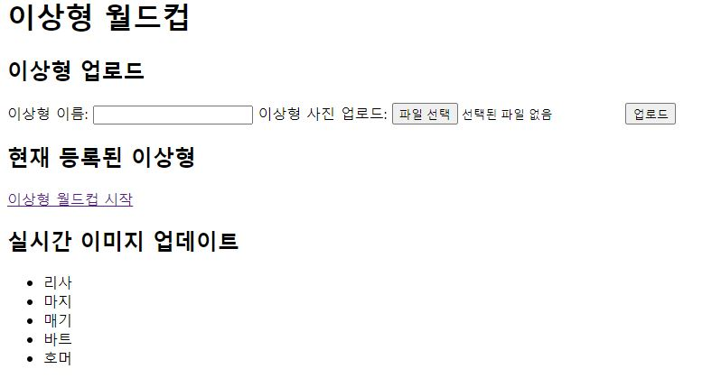
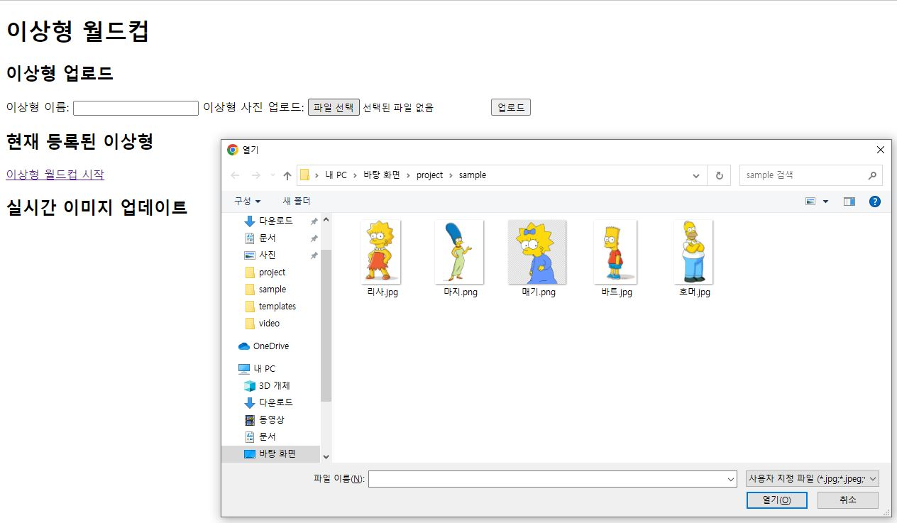
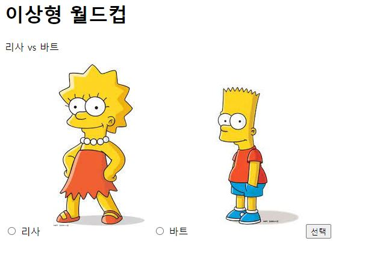

# Ideal Tournament
## Overview


## How it Works
### Game Setting

게임을 시작하기 위해서 이상형 월드컵에 사용할 이미지와 이름을 업로드 해야한다.

### Game Paly

이상형 월드컵을 진행하면 된다.

## Setup and Configuration
### Installation
실행 전 Python을 우선 설치해야 한다.

이 애플리케이션을 실행 하기 위해 아래의 라이브러리를 설치하면 된다.
```bash
pip install Flask
pip install Werkzeug
pip install Jinja2
pip install python-socketio
```
